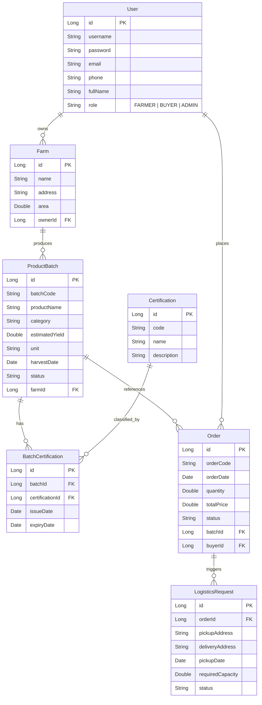

```mermaid
erDiagram
    User {
        Long id PK
        String username
        String password
        String email
        String phone
        String fullName
        String role "FARMER | BUYER | ADMIN"
    }

    Farm {
        Long id PK
        String name
        String address
        Double area
        Long ownerId FK
    }

    ProductBatch {
        Long id PK
        String batchCode
        String productName
        String category
        Double estimatedYield
        String unit
        Date harvestDate
        String status
        Long farmId FK
    }

    Certification {
        Long id PK
        String code
        String name
        String description
    }

    BatchCertification {
        Long id PK
        Long batchId FK
        Long certificationId FK
        Date issueDate
        Date expiryDate
    }

    Order {
        Long id PK
        String orderCode
        Date orderDate
        Double quantity
        Double totalPrice
        String status
        Long batchId FK
        Long buyerId FK
    }

    LogisticsRequest {
        Long id PK
        Long orderId FK
        String pickupAddress
        String deliveryAddress
        Date pickupDate
        Double requiredCapacity
        String status
    }

    User ||--o{ Farm : owns
    Farm ||--o{ ProductBatch : produces
    ProductBatch ||--o{ BatchCertification : has
    Certification ||--o{ BatchCertification : classified_by
    ProductBatch ||--o{ Order : references
    User ||--o{ Order : places
    Order ||--o{ LogisticsRequest : triggers
```
