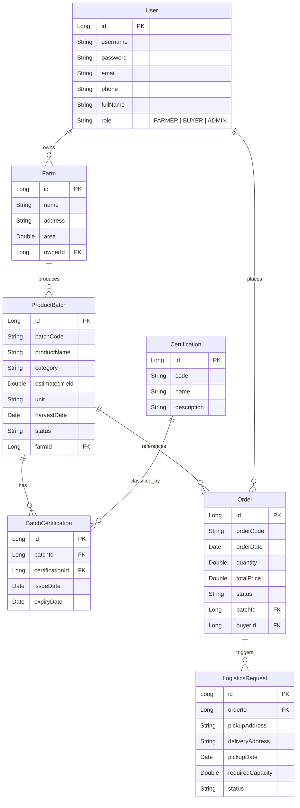

# BÁO CÁO HACKATHON - TÁI CẤU TRÚC & PHÂN TÍCH HỆ THỐNG

**Mã sinh viên:** RE12345_VuNguyenHoangDuong_Hackathon_AI_DE010

---

## MỤC TIÊU KỸ THUẬT

Dự án sử dụng các giải pháp công nghệ và kiến trúc sau:

| Phần | Kỹ thuật | Mô tả |
|------|----------|-------|
| 1 | **Strategy Pattern + Registry** | Tách logic tính chi phí thành các class độc lập, đăng ký qua StrategyRegistry để thêm loại hình canh tác mới mà không sửa code lõi |
| 2 | **CascadeType.PERSIST** | Giải quyết lỗi TransientPropertyValueException bằng cách cho phép Hibernate tự động persist entity SensorDevice khi DailyReport được lưu |
| 2 | **@RestControllerAdvice** | Bắt lỗi DataAccessException toàn cục, trả về JSON format thay vì sập server |
| 3 | **Spring Boot + JPA + MySQL + Java 8 Streams** | Kiến trúc Monolithic Java Web với chuẩn hóa dữ liệu, truy vấnhệ thống linh hoạt, xử lý dữ liệu stream |

---

## PHẦN 1: TÁI CẤU TRÚC HỆ THỐNG (STRATEGY PATTERN)

### Lịch sử Prompt (Prompt Chain)

**Prompt 1:**
> Tôi có một hệ thống Smart Agriculture với class FarmMaintenanceService chứa hàm calculateMaintenanceCost sử dụng if-else để tính chi phí bảo trì cho từng loại địa hình (RICE_TERRACES, STRAWBERRY_GREENHOUSE, FRUIT_ORCHARD). Hãy tái cấu trúc dùng Strategy Pattern. Tạo interface MaintenanceStrategy, các class concrete cho từng loại, và một StrategyRegistry. Đảm bảo khi thêm loại mới (GINSENG_VALLEY) chỉ cần tạo class mới không sửa code FarmMaintenanceService.

**Kết quả Prompt 1:** AI sinh ra interface MaintenanceStrategy với method `calculateBaseCost()` cùng các class RiceTerraceStrategy, StrawberryGreenhouseStrategy, FruitOrchardStrategy. FarmMaintenanceService nhận vào StrategyRegistry và gọi `registry.getStrategy(farm.getTerrainType())`.

**Prompt 2:**
> Hãy thêm một loại hình canh tác mới "GINSENG_VALLEY" với chi phí 5.500.000 VNĐ/tháng và log message riêng. Chứng tỏ rằng việc thêm mới hoàn toàn không ảnh hưởng đến FarmMaintenanceService.

**Kết quả Prompt 2:** AI tạo class GinsengValleyStrategy implements MaintenanceStrategy. FarmMaintenanceService không cần sửa - chỉ cần đăng ký `registry.register(new GinsengValleyStrategy())` bên ngoài.

### Phân tích lỗi AI

**Lỗi:** Ở lần sinh đầu tiên, AI tạo FarmMaintenanceService với các strategy được khởi tạo cứng (hardcode) trong constructor, vẫn vi phạm OCP nếu muốn thêm loại mới.

**Cách khắc phục:** Yêu cầu AI tách riêng StrategyRegistry ra khỏi FarmMaintenanceService và inject registry qua constructor. Như vậy FarmMaintenanceService đóng với việc sửa đổi nhưng mở với việc mở rộng (OCP).

### Code kết quả (src/farm/)

```
src/farm/
├── entity/
│   ├── FarmArea.java              # Model khu vực canh tác
│   └── Invoice.java               # Model hóa đơn
├── repository/                    # Sẵn sàng mở rộng
└── service/
    ├── MaintenanceStrategy.java   # Interface chiến lược
    ├── RiceTerraceStrategy.java   # Ruộng bậc thang: 2.500.000 VNĐ/tháng
    ├── StrawberryGreenhouseStrategy.java # Nhà kính dâu: 4.000.000 VNĐ/tháng
    ├── FruitOrchardStrategy.java  # Vườn cây ăn quả: 1.000.000 VNĐ/tháng
    ├── GinsengValleyStrategy.java # Vườn sâm thung lũng: 5.500.000 VNĐ/tháng
    ├── StrategyRegistry.java      # Registry quản lý các strategy
    └── FarmMaintenanceService.java # Service đã refactor (không còn if-else)
```

---

## PHẦN 2: DEBUGGING BẢO MẬT & XỬ LÝ LỖI

### Lịch sử Prompt

**Prompt 1:**
> Tôi gặp lỗi Hibernate: `org.hibernate.TransientPropertyValueException: object references an unsaved transient instance - save the transient instance before flushing`. Trong SensorDataService, tôi tạo một SensorDevice mới (transient) và gán vào DailyReport (quan hệ ManyToOne) rồi save(report). Nguyên nhân là gì?

**Kết quả:** AI giải thích rằng DailyReport có @ManyToOne trỏ tới SensorDevice nhưng không có cascade. Khi reportRepo.save(report) được gọi, Hibernate flush và phát hiện SensorDevice là transient (chưa có trong DB) nhưng không được phép tự động persist.

**Prompt 2:**
> Hãy sửa lỗi bằng cách thêm cascade vào @ManyToOne và thêm @RestControllerAdvice để bắt lỗi toàn cục.

**Kết quả:**
```java
// DailyReport.java
@ManyToOne(cascade = CascadeType.PERSIST)
@JoinColumn(name = "sensor_device_id", nullable = false)
private SensorDevice sensorDevice;
```

```java
// GlobalExceptionHandler.java
@RestControllerAdvice
public class GlobalExceptionHandler {
    @ExceptionHandler(DataAccessException.class)
    public ResponseEntity<Map<String, String>> handleDataAccessException(DataAccessException ex) {
        return ResponseEntity.status(HttpStatus.INTERNAL_SERVER_ERROR)
            .body(Map.of("error", "DATABASE_ERROR", "message", "Không thể lưu dữ liệu đồng bộ"));
    }
}
```

### Giải thích CascadeType.PERSIST

`CascadeType.PERSIST` cho Hibernate biết rằng khi thực hiện thao tác `persist()` (hoặc `save()`) trên entity cha (DailyReport), thao tác đó sẽ được "truyền xuống" (cascade) cho entity con (SensorDevice). Cụ thể:
- Khi `reportRepo.save(report)` được gọi, Hibernate không chỉ INSERT vào bảng `daily_reports` mà còn tự động INSERT vào bảng `sensor_devices` trước (vì khóa ngoại phải tồn tại).
- Nếu không có cascade, Hibernate sẽ ném TransientPropertyValueException vì SensorDevice ở trạng thái **Transient** (chưa từng được lưu), không thể dùng làm khóa ngoại.

### Phân tích lỗi AI

**Lỗi:** Ở lần đầu, AI chỉ đề xuất thêm `cascade = CascadeType.ALL` mà không giải thích tại sao không nên dùng ALL.

**Cách khắc phục:** Yêu cầu AI giải thích chi tiết và chọn CascadeType.PERSIST thay vì ALL. ALL bao gồm cả REMOVE và DETACH, nếu xóa DailyReport sẽ vô tình xóa SensorDevice - điều không mong muốn vì một SensorDevice có thể có nhiều báo cáo. PERSIST chỉ cho phép tự động lưu, an toàn hơn.

### Code kết quả (src/exception/)

```
src/exception/
├── entity/
│   ├── SensorDevice.java          # Entity thiết bị cảm biến
│   └── DailyReport.java           # Entity báo cáo (có cascade = PERSIST)
├── repository/
│   └── DailyReportRepository.java # JPA Repository
├── service/
│   └── SensorDataService.java     # Service đã sửa
├── handler/
│   └── GlobalExceptionHandler.java # Bắt lỗi toàn cục
└── dto/
    ├── ReportRequest.java         # Request DTO
    └── ReportResponse.java        # Response DTO
```

---

## PHẦN 3: PHÂN TÍCH & THIẾT KẾ HỆ THỐNG

### Nhiệm vụ 1: Đề xuất Giải pháp Công nghệ (Tech Stack)

#### Prompt gửi AI
> **Prompt:** Tôi đang xây dựng "AgriSmart Market" - Nền tảng Quản lý Nông trại và Giao thương Nông sản trực tuyến. Yêu cầu:
> 1. 3 role: Farmer, Buyer, Admin
> 2. Quản lý nông sản & chứng nhận (VietGAP, GlobalGAP, OCOP) - thiết kế chuẩn hóa DB
> 3. Thống kê sản lượng bằng Java 8 Streams
> 4. Tự động gọi API Logistics bên thứ ba
>
> Hãy đề xuất Tech Stack cho hệ thống Monolithic Java Web và giải thích lý do chọn từng công nghệ.

#### Kết quả AI đề xuất

| Công nghệ | Lý do |
|-----------|-------|
| **Java 17 + Spring Boot 3** | Framework chuẩn cho monolithic Java Web, hỗ trợ JPA, REST, validation |
| **Spring Data JPA + Hibernate** | ORM mạnh, hỗ trợ chuẩn hóa DB quan hệ |
| **MySQL 8** | ACID compliant, phù hợp giao dịch tài chính, hỗ trợ FULLTEXT search |
| **Java 8 Streams API** | Xử lý group by / reduce trên Collection, đáp ứng yêu cầu không dùng for/while |
| **RestTemplate / WebClient** | Gọi API Logistics bên thứ ba |
| **Spring Security + JWT** | Phân quyền 3 role, bảo mật API |
| **Maven** | Quản lý dependency, build tự động |
| **Lombok** | Giảm boilerplate code (getter/setter) |

#### Nhận xét phản biện

**Đồng ý:** Spring Boot + JPA + MySQL là lựa chọn phù hợp cho monolithic. Streams API đáp ứng đúng yêu cầu nghiệp vụ.

**Phản biện:** AI không đề xuất **Redis** cho caching nếu dữ liệu cảm biến IoT tần suất cao, và không đề cập **RabbitMQ/ Kafka** cho việc gọi API Logistics bất đồng bộ - nếu API bên thứ ba chậm, thread pool của ứng dụng sẽ bị chiếm giữ. Bổ sung: dùng `@Async` + RabbitMQ để tách rời luồng gọi logistics.

---

### Nhiệm vụ 2: Phân tích Thực thể (Entity Analysis)

#### Prompt gửi AI
> **Prompt:** Từ nghiệp vụ AgriSmart Market ở trên, hãy phân tích và xác định các thực thể (Entity) cốt lõi cho Database. Đặc biệt lưu ý:
> - Mỗi lô Nông sản (Batch) có thể đạt nhiều tiêu chuẩn chứng nhận (VietGAP, GlobalGAP, OCOP)
> - KHÔNG dùng mảng hay JSON để lưu chứng nhận - phải chuẩn hóa thành bảng quan hệ
> - Thương lái cần tìm kiếm động theo loại chứng nhận
> - Liệt kê các thuộc tính chính và mối quan hệ giữa các Entity

#### Kết quả - Danh sách Entities

| Entity | Thuộc tính chính | Ghi chú |
|--------|------------------|---------|
| **User** | id, username, password, email, phone, fullName, role (FARMER/BUYER/ADMIN) | Lưu thông tin tài khoản |
| **Farm** | id, name, address, area, ownerId (FK → User) | Mỗi nông trại thuộc 1 Farmer |
| **ProductBatch** | id, batchCode, productName, category, estimatedYield, unit, harvestDate, status, farmId (FK → Farm) | Lô nông sản |
| **Certification** | id, code, name, description | Danh mục chứng nhận (VietGAP, GlobalGAP, OCOP) |
| **BatchCertification** | id, batchId (FK), certificationId (FK), issueDate, expiryDate | Bảng trung gian N-N giữa ProductBatch và Certification |
| **Order** | id, orderCode, orderDate, quantity, totalPrice, status, batchId (FK), buyerId (FK → User) | Đơn mua bán |
| **LogisticsRequest** | id, orderId (FK), pickupAddress, deliveryAddress, pickupDate, requiredCapacity, status | Yêu cầu vận chuyển |

#### Giải thích thiết kế chuẩn hóa Certification

Thay vì lưu `["VietGAP", "GlobalGAP"]` trong một cột JSON của ProductBatch, thiết kế dùng 3 bảng:
- **Certification**: danh sách các loại chứng nhận (VietGAP, GlobalGAP, OCOP 3 sao)
- **ProductBatch**: thông tin lô nông sản
- **BatchCertification**: bảng trung gian (liên kết N-N)

Query tìm kiếm động theo chứng nhận:
```sql
SELECT pb.* FROM product_batch pb
JOIN batch_certification bc ON pb.id = bc.batch_id
JOIN certification c ON bc.certification_id = c.id
WHERE c.code IN ('VIETGAP', 'OCOP_3SAO');
```

Điều này cho phép thương lái lọc linh hoạt theo tổ hợp chứng nhận mà không cần parse JSON.

---

### Nhiệm vụ 3: Thiết kế Sơ đồ Quan hệ Thực thể (ERD)

#### Prompt gửi AI
> **Prompt:** Dựa trên các Entity đã chốt, hãy tạo mã Mermaid để vẽ sơ đồ ERD hoàn chỉnh cho hệ thống AgriSmart Market. Bao gồm tất cả các thực thể: User, Farm, ProductBatch, Certification, BatchCertification, Order, LogisticsRequest. Thể hiện rõ khóa chính, khóa ngoại và mối quan hệ giữa các bảng.

#### Kết quả - Mã Mermaid ERD

File đầy đủ tại: `docs/erd_diagram.md`



**Cách render:** Copy đoạn mã trên vào https://mermaid.live/ hoặc dùng plugin Mermaid trong VS Code/Markdown editor để xuất ra `docs/erd_diagram.png`.

---

## CẤU TRÚC THƯ MỤC

```
RE12345_VuNguyenHoangDuong_Hackathon_AI_DE010/
├── src/
│   ├── farm/
│   │   ├── entity/
│   │   │   ├── FarmArea.java
│   │   │   └── Invoice.java
│   │   ├── repository/
│   │   └── service/
│   │       ├── FarmMaintenanceService.java
│   │       ├── FruitOrchardStrategy.java
│   │       ├── GinsengValleyStrategy.java
│   │       ├── MaintenanceStrategy.java
│   │       ├── RiceTerraceStrategy.java
│   │       ├── StrategyRegistry.java
│   │       └── StrawberryGreenhouseStrategy.java
│   └── exception/
│       ├── dto/
│       │   ├── ReportRequest.java
│       │   └── ReportResponse.java
│       ├── entity/
│       │   ├── DailyReport.java
│       │   └── SensorDevice.java
│       ├── handler/
│       │   └── GlobalExceptionHandler.java
│       ├── repository/
│       │   └── DailyReportRepository.java
│       └── service/
│           └── SensorDataService.java
├── docs/
│   ├── erd_diagram.md          # Mã Mermaid ERD
│   └── erd_diagram.png         # Hình ảnh ERD (render từ Mermaid)
├── README.md                   # Báo cáo & Lịch sử Prompt
└── .gitignore
```
